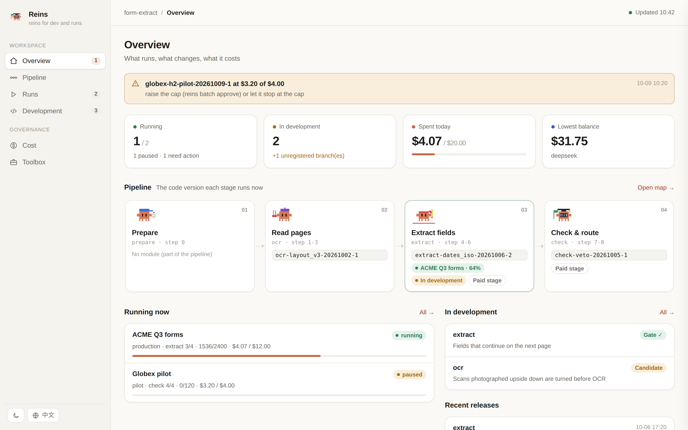
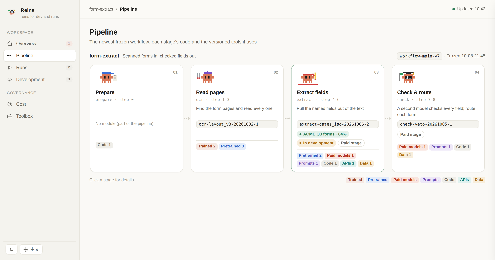
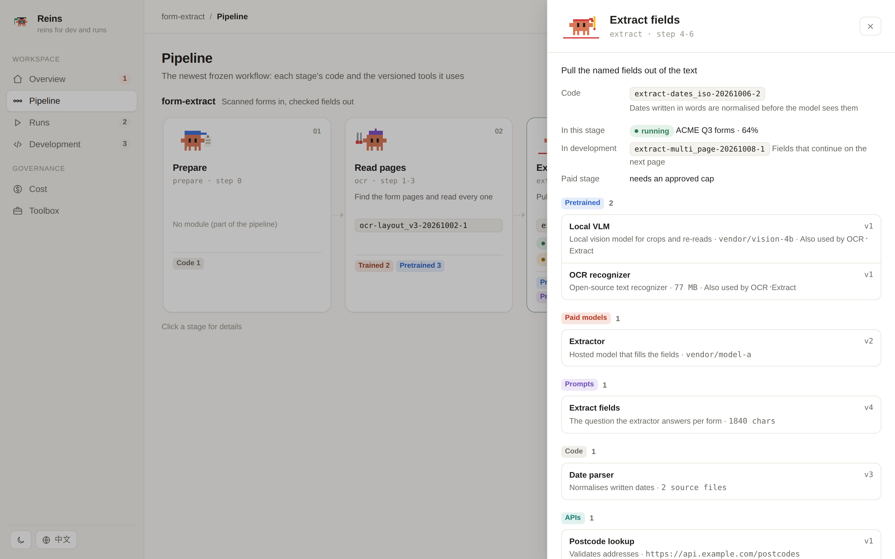
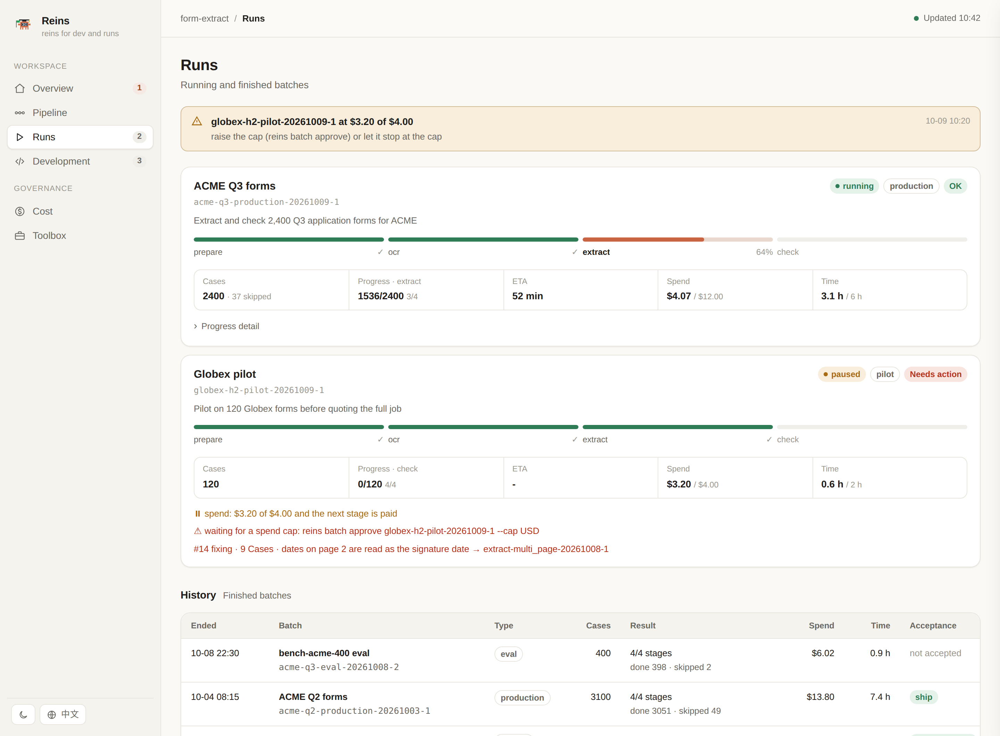
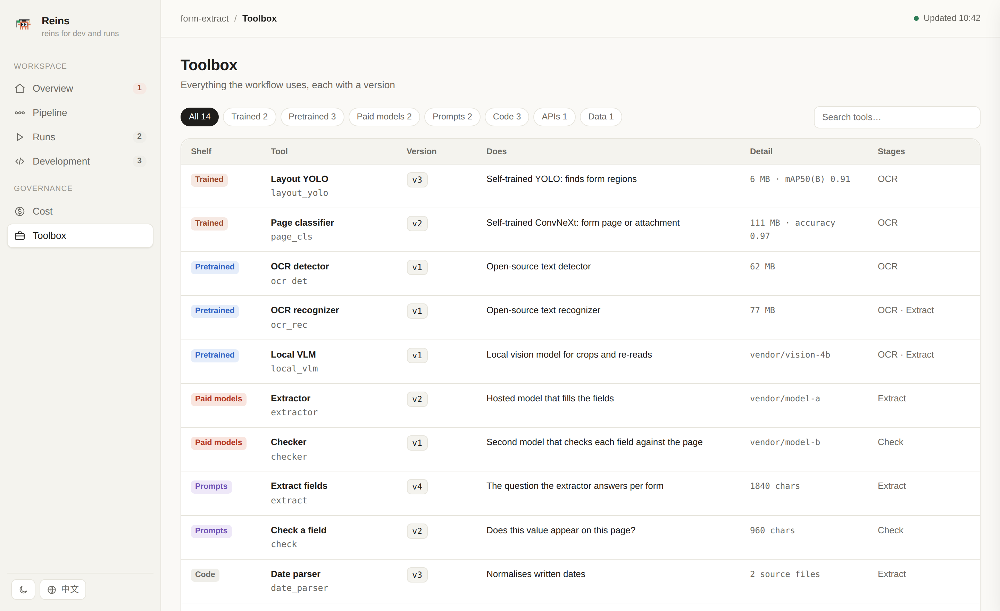
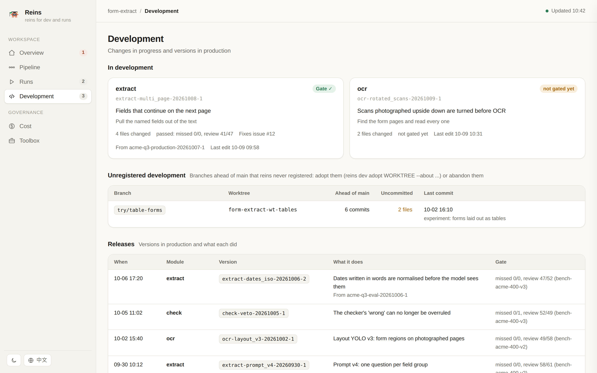
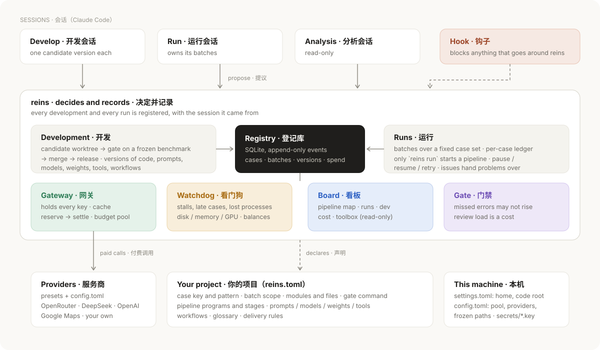
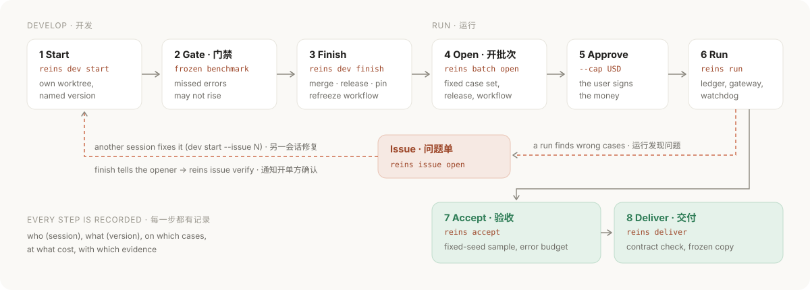

# ReinsLite

**Reins for AI pipelines that coding agents build and run.**
Sessions propose; reins decides and records. Every development and every run is registered, versioned, budgeted and traceable.

**English** · [简体中文](README.zh-CN.md)

<p align="center">
  <picture>
    <source media="(prefers-color-scheme: dark)" srcset="docs/images/overview-dark.png">
    
  </picture>
</p>

---

## Why

When coding agents (for example Claude Code sessions) write, fork and run your AI pipelines all day, the same accidents keep happening:

- a forked session starts a production run it does not own;
- someone merges into `main` by hand, and nobody can say which change reached production;
- a prompt, a model id or a weights file changes, and no one knows which batch used which;
- parallel paid calls overshoot the budget before anyone notices;
- cases silently disappear between two stages;
- a run finds a problem, another session fixes it, and the fix never makes it back to the run.

ReinsLite is a small, local control layer that removes the *possibility* of these accidents rather than asking agents to be careful. It is project-neutral: a project describes itself in one `reins.toml`, and the framework never learns its domain words.

## What you get

| | |
|---|---|
| **Development** | Each change lives in its own worktree as a named version (`extract-dates_iso-20261006-2`). It merges only through a gate on a frozen benchmark: missed errors may not rise. |
| **Runs** | A batch is a fixed case set with planned stages. Only `reins run` may start a pipeline; it supervises, pauses, resumes and retries. A per-case ledger refuses to close a stage with a case missing. |
| **Money** | One gateway holds every provider key. Calls reserve their estimate first and settle the real cost after, under batch, stage, session and team-pool caps. Identical requests are served from cache; repeated failures pause the stage. |
| **Versions of everything** | Code, prompts, model configs, ML weights (with their training record), tools, data files and whole workflows, each content-addressed as `<kind>-<name>-vN`. |
| **Hand-over** | A run opens an issue on the cases it got wrong; another session claims it, fixes it through the gate, and the opener is told which version to resume with. |
| **Traceability** | Who (which session), what (which version), on which cases, at what cost, with which evidence. Append-only, in one SQLite registry. |
| **Board** | A local web app: the pipeline map with each stage's code version and tools, runs, development, cost and the toolbox. |

## The board

A pixel crab per stage. Click a stage to see the code version it runs, the batch in it, what is being changed, and every versioned tool it picks up.

<p align="center"></p>
<p align="center"></p>

Running batches show a stage stepper, five numbers and whatever needs a person (an approval, an open issue).

<p align="center"></p>

<table>
  <tr>
    <td width="50%"></td>
    <td width="50%"></td>
  </tr>
  <tr>
    <td align="center">Toolbox: every prompt, model, weights file, tool and data file, by shelf</td>
    <td align="center">Development: changes in progress, unregistered branches, releases</td>
  </tr>
</table>

Light and dark themes, English and Chinese, and a phone layout without sideways scrolling.

## Architecture

<p align="center"></p>

- **Sessions** only propose. A Claude Code hook records what each session does and blocks what goes around reins: hand merges into `main`, pipelines started with `nohup`, edits outside the session's own worktree, writes into frozen paths. It fails open, so a session never gets stuck.
- **The registry** (`$REINS_HOME/reins.db`, SQLite, append-only events) is the single record of cases, batches, versions, gates, spend, reviews, issues and decisions.
- **The gateway** is the only process with provider keys. Pipelines get `<ENV>_BASE_URL` and a batch token instead of a key.
- **The watchdog** notices stalls, late cases, lost processes, low disk, memory or GPU, and low balances.
- **Your project** declares everything domain-specific in `reins.toml`; **this machine** keeps paths, the budget pool, providers and secrets.

## The loop

<p align="center"></p>

## Money and limits

| Control | How |
|---|---|
| Reserve, then settle | Each paid call takes the write lock, reserves its estimate against every cap, and settles the provider's reported cost (or the price table) afterwards. Parallel calls cannot overshoot. |
| Team budget pool | All sessions together: hourly, daily and weekly caps; a per-session daily cap; a ceiling on any one batch's cap. |
| Approval | A paid stage cannot start until a person approves a cap (`reins batch approve B --cap 8`). At the cap the gateway answers 402, pauses the batch and notifies. |
| Repeated calls | Identical requests are answered from the cache at no cost and still logged (drift batches bypass it on purpose). |
| Consecutive failures | After N failed paid calls in a row the stage pauses instead of spending on errors. |
| Attribution | Every row carries batch, stage, module version, provider and model; balances are polled from each provider. |

Providers are presets plus `config.toml` (OpenRouter, DeepSeek, OpenAI, Google Maps; add your own OpenAI-compatible or per-call GET service in a few lines).

## Versions of everything

| Kind | Name | Identity |
|---|---|---|
| Code | `<module>-<suffix>-<YYYYMMDD>-<n>` | a gated merge into `main` |
| Prompt | `prompt-<name>-vN` | the text of a constant or file |
| Model config | `model-<name>-vN` | provider, model id, fixed parameters |
| ML weights | `weights-<name>-vN` | file content; training record harvested (Ultralytics, JSON-logging trainers) |
| Tool | `tool-<name>-vN` | source files, API endpoint and parameters, or a data file |
| Workflow | `workflow-<name>-vN` | every stage with the versions above, refrozen after each release |
| Benchmark | `bench-<name>-vN` | frozen case set, graded labels, dev / holdout split |

Before a production batch starts, preflight checks that every weights and data file on disk is a registered version, so a model cannot be swapped silently.

## Contracts

The design is a set of contracts, each backed by real incidents ([docs/DESIGN.md](docs/DESIGN.md)).

| | | | |
|---|---|---|---|
| C0 Glossary: one word, one meaning | C1 Case ledger and conservation | C2 Module versions | C3 Batches |
| C4 Frozen benchmarks | C5 Gate | C6 Review records | C7 Router and recovery |
| C8 Watchdog | C9 Spend, gateway, budget pool | C10 Leases | C11 Acceptance |
| C12 Immutable deliverables | C13 Decisions | C14 Board | C15 Session index |
| C16 Issues (hand-over) | C17 Artifact versions | | |

## Adopt a project

1. Put a `reins.toml` at the repo root. Start from [examples/reins.toml](examples/reins.toml) (a fictional form-extraction project that shows every option). A minimal one:

   ```toml
   project = "form-extract"
   case_key = "form_id"              # your name for the case key column
   case_id_pattern = "^F[0-9]{6}$"

   [batch]
   scope = ["client", "package"]     # batch names: acme-q3-pilot-20261008-1

   [dev]
   repo = "/path/to/form-extract"
   gate = "python3 bench/gate.py"    # exit 0 = passed; may write metrics to $REINS_GATE_OUT

   [run]
   programs = ["run_all.sh"]         # only `reins run` may start these
   stages = ["prepare", "ocr", "extract", "check"]

   [modules.extract]
   about = "pull the named fields out of the OCR text"
   files = ["form_extract/extract/*"]
   ```

2. `reins config check` confirms that every name you use is declared.
3. `reins artifact scan` registers your prompts, models, weights and tools; `reins workflow freeze main` freezes the workflow.
4. At the end of each stage your pipeline reports outcomes: `reins batch mark BATCH STAGE --file outcomes.tsv` (first column: the case key).
5. Point paid calls at `<ENV>_BASE_URL` / `<ENV>_API_KEY`; `reins run` sets them for every provider in use.

## Install on a machine

```bash
git clone https://github.com/jiaazhaoo/ReinsLite.git && cd ReinsLite
mkdir -p ~/.config/reins
printf 'home = "/data/reins"\ncode_root = "%s"\n' "$(dirname "$PWD")" > ~/.config/reins/settings.toml
mkdir -p /data/reins/secrets && chmod 700 /data/reins/secrets
echo "sk-..." > /data/reins/secrets/openrouter.key && chmod 600 /data/reins/secrets/openrouter.key
bin/reins-install-services          # gateway :8790, watchdog, board :8791 as systemd --user units
```

Then add the Claude Code hook (`hooks/session_hook.py`) to `~/.claude/settings.json` as shown in [docs/WORKFLOW.md](docs/WORKFLOW.md). Python 3.11+ and the standard library; `openpyxl` only for `.xlsx` files (deliverable checks, header lint).

## Everyday commands

```bash
reins dev start extract multi_page --about "fields that continue on the next page" --issue 14
reins dev finish extract-multi_page-20261009-1        # gate, merge, release, pin, refreeze
reins batch open --scope acme-q3 --type production --workflow workflow-main-v7 \
    --cases cases.csv --purpose "Q3 delivery" --work-dir /data/acme/q3
reins batch approve acme-q3-production-20261009-1 --cap 12
reins run acme-q3-production-20261009-1 --self-staged -- tools/run_all.sh /data/acme/q3
reins ctl pause|resume|stop <batch>
reins issue open --batch <batch> --cases F000101,F000102 --symptom "dates on page 2 read as the signature date"
reins weights list · reins artifact list · reins spend · reins board serve
```

## Repository layout

```
reins/            the framework (registry, CLI, gateway, runner, watchdog, board, contracts)
reins/board_ui/   the board: index.html, app.css, app.js (no build step)
hooks/            Claude Code hooks: session index and guard rails
systemd/          unit templates (installed by bin/reins-install-services)
examples/         reins.toml, glossary.toml, rules.toml, review.toml for a fictional project
docs/             DESIGN.md (contracts and the incidents behind them), WORKFLOW.md (how sessions work)
tests/            unit tests (python3 -m unittest discover -s tests)
```

## Status

Used daily on a production geospatial QA pipeline (the first adopter). Working today: everything above. Known gaps, in the order we plan to close them:

- release reservations left open by a crashed gateway call;
- enforce time limits (kill a late case, pause a batch over its time budget) instead of only notifying;
- gate metrics declared by each project, not fixed to missed errors and review load;
- the gateway: Anthropic Messages, embeddings, other POST APIs and streaming;
- run kinds beyond batches: training jobs and long-running services;
- per-case spend caps, call-count and step-depth limits for agent-style stages.

Single machine, SQLite. Hooks are written for Claude Code; any agent can drive the CLI.
