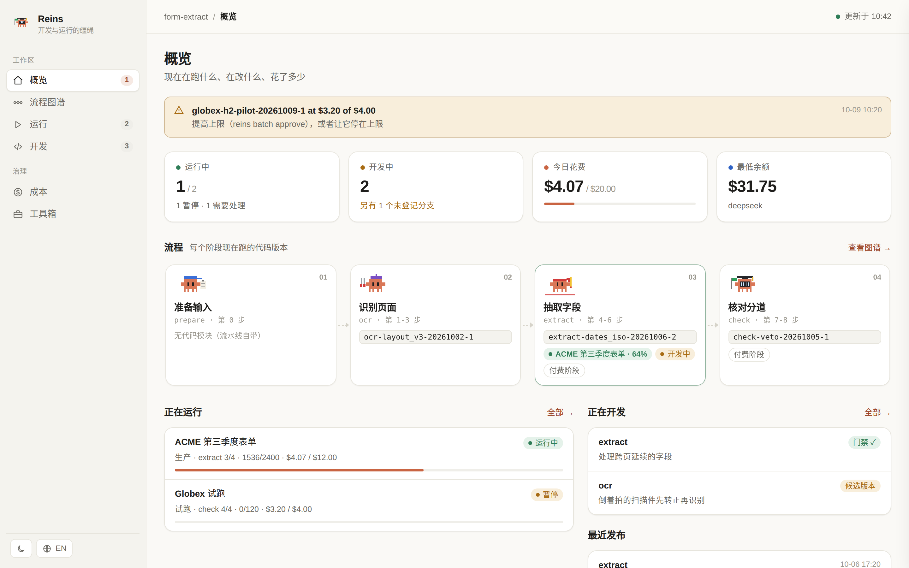
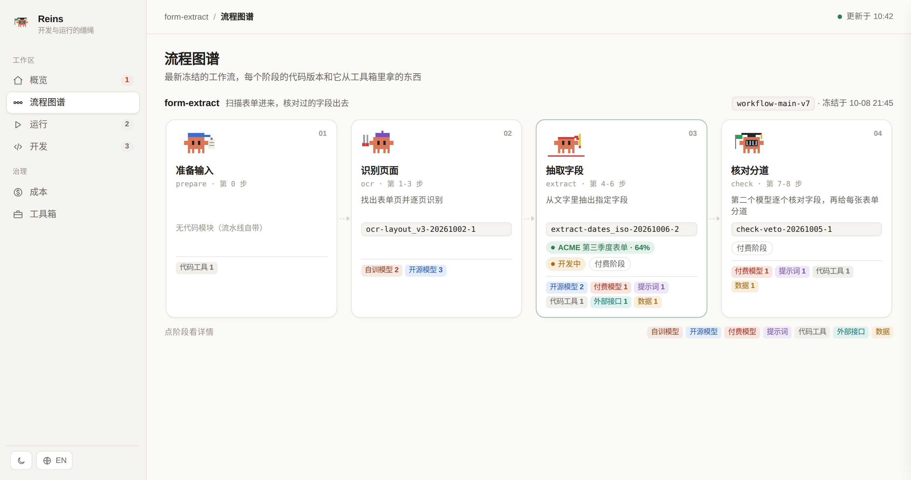
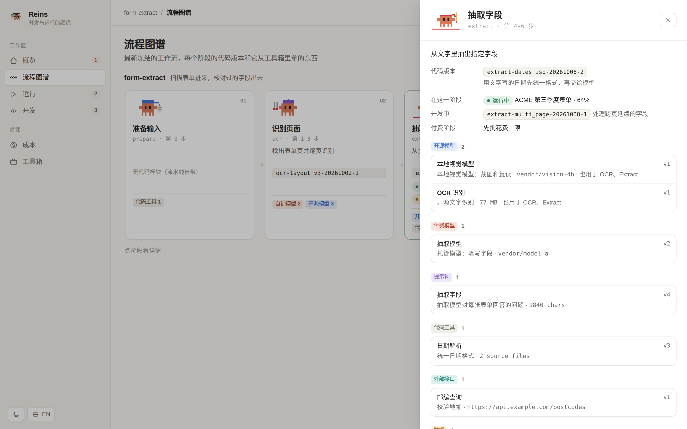
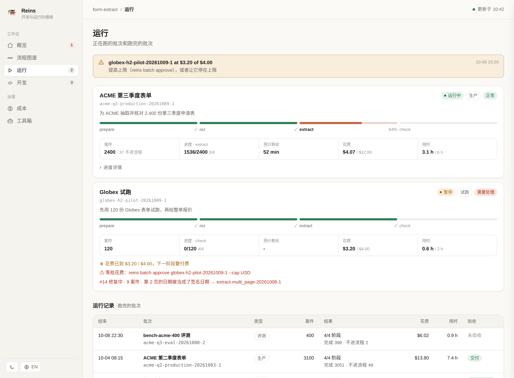
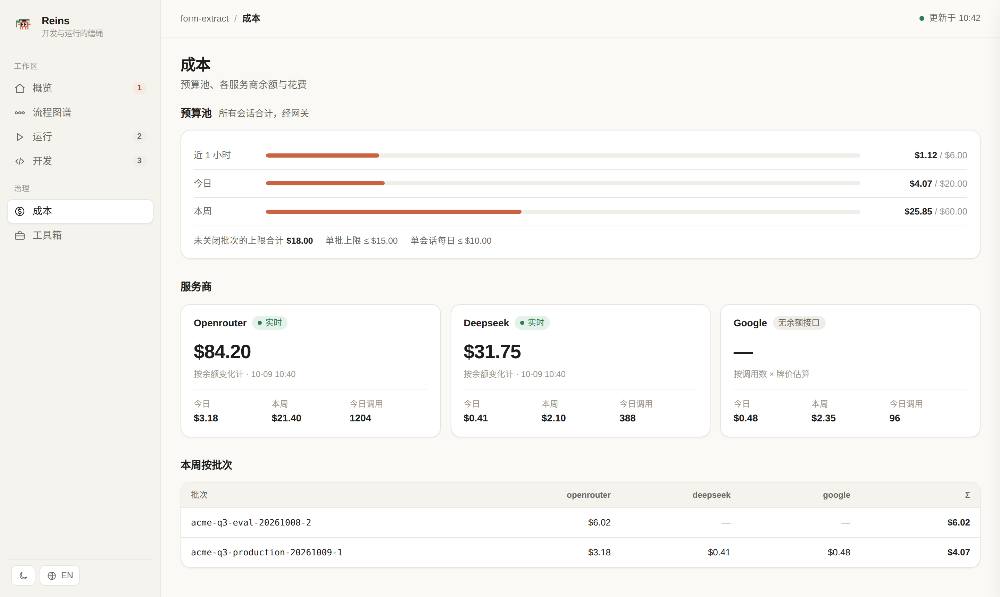
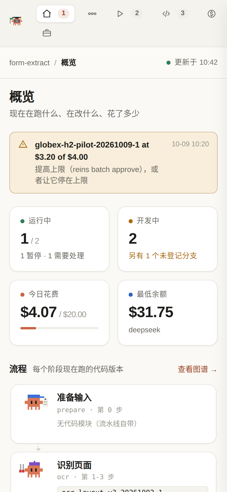

# ReinsLite

**给"由编码智能体开发和运行的 AI 流水线"套上的缰绳。**
会话只提议，reins 决定并记录。每一次开发、每一次运行都有登记、有版本、有预算、可追溯。

[English](README.md) · **简体中文**

<p align="center"></p>

---

## 为什么需要它

当编码智能体（比如 Claude Code 会话）整天在写、在 fork、在运行你的 AI 流水线，同样的事故会反复发生：

- 一个 fork 出来的会话，启动了不属于它的生产运行；
- 有人手动合并进 `main`，没人说得清哪个改动进了生产；
- 提示词、模型 id 或权重文件变了，没人知道哪个批次用的是哪一版；
- 并发的付费调用在有人察觉之前就超了预算；
- 案件在两个阶段之间悄悄丢失；
- 运行时发现了问题，另一个会话修好了，修复却没有回到那次运行。

ReinsLite 是一层很小的本地控制层。它不靠提醒智能体"小心一点"，而是让这些事故**根本没有机会发生**。它与具体项目无关：一个项目用一份 `reins.toml` 描述自己，框架本身不认识任何领域词。

## 能得到什么

| | |
|---|---|
| **开发** | 每个改动在自己的工作区里，是一个有名字的版本（`extract-dates_iso-20261006-2`）。只有在冻结的基准集上过了门禁才能合并：漏判不许增加。 |
| **运行** | 批次是一组固定的案件加计划好的阶段。只有 `reins run` 能启动流水线，负责监督、暂停、恢复、重试。逐案件账本：少一个案件，阶段就不能结束。 |
| **钱** | 一个网关持有全部服务商密钥。每次调用先预留估价、再按实际花费结算，受批次、阶段、会话和团队预算池的上限约束。相同请求走缓存；连续失败会暂停阶段。 |
| **一切都有版本** | 代码、提示词、模型配置、机器学习权重（连同训练记录）、工具、数据文件、整个工作流，都按内容寻址，命名为 `<种类>-<名字>-vN`。 |
| **交接** | 运行方对出错的案件开问题单；另一个会话认领、经门禁修好，开单方会被告知用哪个版本恢复。 |
| **可追溯** | 谁（哪个会话）、改了什么（哪个版本）、在哪些案件上、花了多少钱、凭什么证据。只追加，全在一个 SQLite 登记库里。 |
| **看板** | 本地网页：流程图谱（每个阶段的代码版本和工具）、运行、开发、成本、工具箱。 |

## 看板

每个阶段一只像素小螃蟹。点开一个阶段，能看到它正在跑的代码版本、在这个阶段的批次、正在改的东西，以及它拿的每一件有版本的工具。

<p align="center"></p>
<p align="center"></p>

运行中的批次：阶段进度条、五个关键数字，以及需要人处理的事（批花费、待修的问题单）。

<p align="center"></p>

<table>
  <tr>
    <td width="62%"></td>
    <td width="38%"></td>
  </tr>
  <tr>
    <td align="center">成本：预算池、各服务商余额、按批次的花费</td>
    <td align="center">手机：没有任何横向滚动</td>
  </tr>
</table>

浅色和深色主题、中文和英文界面都可切换。

## 架构

<p align="center"></p>

- **会话**只提议。Claude Code 钩子记录每个会话做了什么，并拦下绕过 reins 的操作：手动合并 `main`、用 `nohup` 启动流水线、改别人工作区里的文件、往冻结目录写东西。钩子出错时放行，不会让会话卡住。
- **登记库**（`$REINS_HOME/reins.db`，SQLite，只追加事件）是案件、批次、版本、门禁、花费、审核、问题单和决定的唯一记录。
- **网关**是唯一持有服务商密钥的进程。流水线拿到的是 `<ENV>_BASE_URL` 和批次令牌，而不是密钥。
- **看门狗**盯着停滞、超时的案件、丢失的进程、磁盘内存显卡占用，以及余额不足。
- **你的项目**把所有领域相关的东西写在 `reins.toml` 里；**本机**保存路径、预算池、服务商和密钥。

## 闭环

<p align="center"></p>

## 钱与限额

| 控制 | 做法 |
|---|---|
| 先预留、后结算 | 每次付费调用先拿写锁、按所有上限预留估价，结束后按服务商报的实际花费（或价格表）结算。并发调用不会超支。 |
| 团队预算池 | 所有会话合计：每小时、每天、每周上限；单会话每日上限；单批次上限的天花板。 |
| 审批 | 付费阶段要人批了上限才能启动（`reins batch approve B --cap 8`）。到顶时网关返回 402、暂停批次并通知。 |
| 重复调用 | 相同请求直接从缓存返回、不花钱，但照样记账（漂移批次特意绕过缓存）。 |
| 连续失败 | 连续 N 次付费调用失败就暂停阶段，不再对着报错花钱。 |
| 成本归属 | 每笔都带批次、阶段、模块版本、服务商和模型；定时查询各服务商余额。 |
| 全部开销 | `reins spend all` 和看板"成本"页：网关账本，加上用 `reins spend import` 导入的历史花费（网关之前的，比如从缓存和运行日志还原的），按天、用途、模型、批次展开，并和各服务商账户的总用量对账，没归属的钱一目了然。 |

服务商是预设加 `config.toml`（OpenRouter、DeepSeek、OpenAI、Google Maps；几行配置就能加上你自己的 OpenAI 兼容接口或按次计费的 GET 接口）。

## 一切都有版本

| 种类 | 名字 | 由什么决定 |
|---|---|---|
| 代码 | `<module>-<suffix>-<YYYYMMDD>-<n>` | 过门禁的合并 |
| 提示词 | `prompt-<name>-vN` | 常量或文件的文本 |
| 模型配置 | `model-<name>-vN` | 服务商、模型 id、固定参数 |
| 机器学习权重 | `weights-<name>-vN` | 文件内容；自动采集训练记录（Ultralytics、JSON 日志型训练器） |
| 工具 | `tool-<name>-vN` | 源文件、接口地址和参数，或数据文件 |
| 工作流 | `workflow-<name>-vN` | 每个阶段及其所用的上述版本，每次发布后自动重新冻结 |
| 基准集 | `bench-<name>-vN` | 冻结的案件集、分级标签、开发集与封存集 |

生产批次启动前，体检会核对磁盘上的每个权重和数据文件都是登记过的版本，模型不可能被悄悄替换。

## 契约

整套设计由一组契约组成，每条都有真实事故作依据（[docs/DESIGN.md](docs/DESIGN.md)）。

| | | | |
|---|---|---|---|
| C0 词表：一词一义 | C1 案件账本与守恒 | C2 模块版本 | C3 批次 |
| C4 冻结的基准集 | C5 门禁 | C6 审核记录 | C7 主控路由与恢复 |
| C8 看门狗 | C9 花费、网关、预算池 | C10 租约 | C11 验收 |
| C12 不可变交付件 | C13 决定记录 | C14 看板 | C15 会话索引 |
| C16 问题单（交接） | C17 产物版本 | | |

## 接入一个项目

1. 在仓库根目录放一份 `reins.toml`。可以从 [examples/reins.toml](examples/reins.toml) 抄起（一个虚构的表单抽取项目，演示了全部选项）。最小的一份：

   ```toml
   project = "form-extract"
   case_key = "form_id"              # 你的案件主键列叫什么
   case_id_pattern = "^F[0-9]{6}$"

   [batch]
   scope = ["client", "package"]     # 批次名：acme-q3-pilot-20261008-1

   [dev]
   repo = "/path/to/form-extract"
   gate = "python3 bench/gate.py"    # 退出码 0 = 通过；可把指标写到 $REINS_GATE_OUT

   [run]
   programs = ["run_all.sh"]         # 只有 reins run 能启动这些
   stages = ["prepare", "ocr", "extract", "check"]

   [modules.extract]
   about = "从 OCR 文字里抽出指定字段"
   files = ["form_extract/extract/*"]
   ```

2. `reins config check`：确认用到的每个名字都有定义。
3. `reins artifact scan` 登记提示词、模型、权重和工具；`reins workflow freeze main` 冻结工作流。
4. 每个阶段结束时，流水线回报结果：`reins batch mark BATCH STAGE --file outcomes.tsv`（第一列是案件主键）。
5. 付费调用改用 `<ENV>_BASE_URL` / `<ENV>_API_KEY`；`reins run` 会给每个在用的服务商设好。

## 在一台机器上安装

```bash
git clone https://github.com/jiaazhaoo/ReinsLite.git && cd ReinsLite
mkdir -p ~/.config/reins
printf 'home = "/data/reins"\ncode_root = "%s"\n' "$(dirname "$PWD")" > ~/.config/reins/settings.toml
mkdir -p /data/reins/secrets && chmod 700 /data/reins/secrets
echo "sk-..." > /data/reins/secrets/openrouter.key && chmod 600 /data/reins/secrets/openrouter.key
bin/reins-install-services          # 网关 :8790、看门狗、看板 :8791，装成 systemd --user 服务
```

然后按 [docs/WORKFLOW.md](docs/WORKFLOW.md) 把 Claude Code 钩子（`hooks/session_hook.py`）加进 `~/.claude/settings.json`。需要 Python 3.11+，只用标准库；只有处理 `.xlsx` 文件（交付件检查、表头词表检查）时才需要 `openpyxl`。

## 常用命令

```bash
reins dev start extract multi_page --about "处理跨页延续的字段" --issue 14
reins dev finish extract-multi_page-20261009-1        # 门禁、合并、发布、钉住产物、重新冻结
reins batch open --scope acme-q3 --type production --workflow workflow-main-v7 \
    --cases cases.csv --purpose "第三季度交付" --work-dir /data/acme/q3
reins batch approve acme-q3-production-20261009-1 --cap 12
reins run acme-q3-production-20261009-1 --self-staged -- tools/run_all.sh /data/acme/q3
reins ctl pause|resume|stop <batch>
reins issue open --batch <batch> --cases F000101,F000102 --symptom "第 2 页的日期被当成签名日期"
reins weights list · reins artifact list · reins spend · reins board serve
```

## 仓库结构

```
reins/            框架本体（登记库、命令行、网关、运行器、看门狗、看板、各契约）
reins/board_ui/   看板前端：index.html、app.css、app.js（无构建步骤）
hooks/            Claude Code 钩子：会话索引和护栏
systemd/          服务单元模板（由 bin/reins-install-services 安装）
examples/         一个虚构项目的 reins.toml、glossary.toml、rules.toml、review.toml
docs/             DESIGN.md（契约及背后的事故）、WORKFLOW.md（会话怎么协作）
tests/            单元测试（python3 -m unittest discover -s tests）
```

## 现状

已在一条生产级的地理空间质检流水线上每天使用（第一个接入的项目）。上面列出的都已可用。已知的缺口，按计划处理的顺序：

- 网关调用中途崩溃时留下的预留，自动回收；
- 时限从"只报警"改为执行：杀掉超时的案件，暂停超出时间预算的批次；
- 门禁指标由各项目自己声明，不再固定为漏判和人工审核量；
- 网关支持 Anthropic Messages、向量化等其他 POST 接口，以及流式输出；
- 批次之外的运行形态：训练任务和长期运行的服务；
- 单案件花费上限、调用次数和步数上限，用于智能体式的阶段。

目前是单机、SQLite。钩子是为 Claude Code 写的，任何智能体都可以通过命令行驱动 reins。
